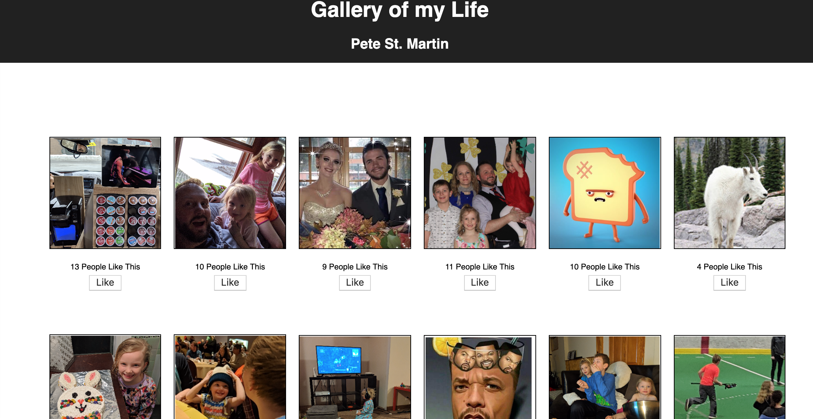

# React - Gallery of My Life

This is a single page application that displays photos from my life!  Click on a photo to see a description.  Click the "Like" button on a photo and the number of "Likes" displayed will increase.

### Built With

Code edited with VS Code using React.
Node.js with Postgress and Express.
Database built on Postico.

### Setup

Fork and Clone from the GitHub Repository.  

All database setup information is located in the database.sql file. Open Postico and execute the database.sql statements.   

Running the server code requires `nodemon`. If you don't already have `nodemon`, install it globally with `npm install nodemon --global`.

```
npm install
npm run server
```

Now that the server is running, open a new terminal tab with `cmd + t` and start the react client app.

```
npm run client
```

Between the server and client, you'll need two terminal tabs. Because we're using `nodemon`, both our client side and server side will automatically spin back up when changes are made.


### Screen Shot

> NOTE: Images don't need to be 100px x 100px but it will be easier if the are all the same dimensions.



### Completed Features
- [x] Server information will save into the database
- [x] 'Like' counter data stores into the database

### Next Steps
- [x] Prepare project for deployment

### Authors
Pete St. Martin

### Acknowledgements
Dane Smith
Chris Black
Luke Schlangen